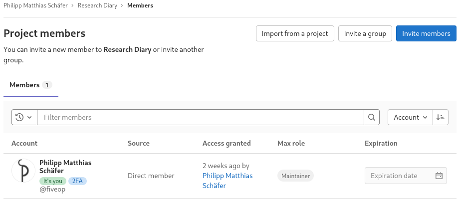

::: questions

- How can multiple people collaborate on a project?

:::

::: objectives

- Explain the concepts of members and roles.
- Add a member to a project.
- Create a group.
- Explain how members relate to groups and a group’s projects.
- Add a member to a group.

:::

So far, each of you has created a GitLab project that not one but you can
contribute to; depending on the visibility setting, no one but you might be able
to even see it.

Git and GitLab can be and is used for one-person projects. But we want our
colleagues to contribute to our research diary, when they keep tabs on our
experiments for us on the weekends. To achieve this, we will grant others access
to our GitLab project.

Using the menu on the right side of the project homepage (or nearly any other
project page), we navigate to the project members page hovering over or clicking
on “Project Information” and then clicking on “Members” in the submenu. The
project member page should look similar to the following screenshot:

{alt="Webpage coutout titled
“Project Members” with three buttons next to the title: “Import from a project”,
“Invite a group”, and “Invite members”. Below a table listing the project’s
members, showing account holder‘s name with account name, the membership source,
when access was granted, the member’s maximum role and the membership expiration
date. The table contains one column: ”Philipp Matthias Schäfer, @fiveop, Direct
member, 2 weeks ago by himself, Maintainer, and no Expiration date."}

On the page we can see the page title, “Project members”, three buttons to the
left of the title, and a filterable table of members, currently only listing
ourselves.

The table shows our full name and account name, why we are a member of this
project, when we got access—at the moment we created the project—what our
maximum role is—more on that in a bit—and a disabled membership expiration date
widget.

For practice we will all add an instructor to our project and remove them again
right away. Click the button labeled “Invite members”, type in the username your
instructors provided you with into the search field, make sure that “Guest” is
selected as a role, and click the button labeled “Invite”.

After reloading the page, your instructor should now be listed next to you in
the table. Unlike in your row, you can change the role and the expiration date
of this new entry. There also is a new, red button in this row labeled “Remove
member”.

The role determines what the member is allowed to do in the project. A
maintainer has full rights, a guest almost none. GitLab’s handbook gives a
detailed [overview](https://docs.gitlab.com/ee/user/permissions.html) of the
different roles’ permissions.

Now, we are going to remove the instructor from your project’s members again.
Click the button labeled “Remove member” in the instructor’s row then click the
button of the same name in the popup dialog. The page reloads itself and the
entry vanishes from the table.

::: challenge

## Adding Members

Get into pairs and add each other with the role “Developer” to your projects.

The “Developer” role grants just enough permissions for all the collaborative
tasks we will practice in this lesson.

This exercise should take about 5 minutes.

:::
