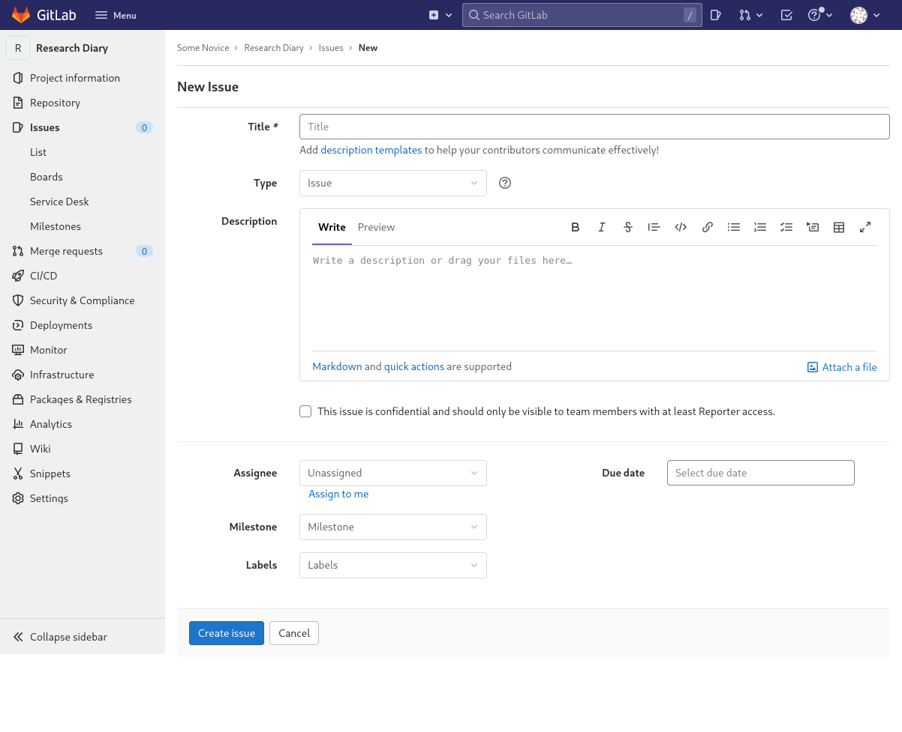
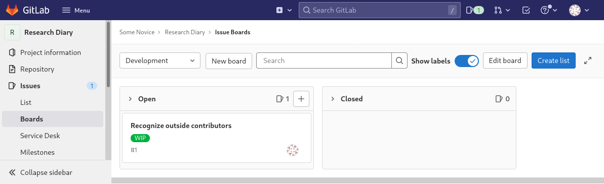

::: questions

- How can I use GitLab to manage development or a whole project?

:::

::: objectives

- Create an issue.
- Comment on an issue.
- Close an issue.
- Use boards to get an overview the state of issues.

:::

## Create Issue

Before our excursion to learn about groups, we contributed lab notes to our
co-learner’s repository. Having done that, we think we should be listed as
contributors in the documentation of that repository. Since, we want our
co-learner to do the honors, we create an issue in their repository, to document
our desire.

Issues are a feature of GitLab that allows us to organize tasks by project and
by group (and its descendant groups and projects). By default anyone that has
read access to a project can file issues. This usually makes sense, because
users can report their problems and ask their questions that way, even when they
are not supposed change anything themselves.

With our co-learner’s help, we navigate to their project. On the side bar menu
on the left we click the entry labeled “Issues” and on the following page we
click on the button labeled “New issue”.

This leads us to the following form:

{alt="New issue form with a text input field
labeled “Title” with subscript “Add description templates to help your
contributors communicate effectively!”, the second and third word being a link,
a drop-down field labeled “Type” showing the word “Issue“, a multi-line text
input field with buttons for text formatting labeled “Description”, a check box
labeled “This issue is confidential and should only be visible to team members
with at least Reporter access.”, drop-down fields labeled “Assignee“,
“Milestone”, and “Label” showing “Unassigned“, “Milestone”, and “Labels”,
respectively, a date input field labeled “Due date”, and two buttons labeled
“Create Issue” and “Cancel”."}

For our issue we provide a short, descriptive title, for example “Recognize
outside contributors” and a description:

```
Outside contributors should be mentioned in the project’s documentation. Their
names could be listed in one of the following locations:

* a section of `README.md`
* a separate `CONTRIBUTORS.md` file
```

::: callout

### Markdown Code Spans and Blocks

Markdown provides syntax for formatting text in a monospaced font, this is
usually used to typeset code, because code is usually written to be readable in
such fonts.

For a monospaced snippet within a normal paragraph, enclose the snippet in a
single backquote (also called backtick or grave accent), for example

```
The filename `README.md` will be set in a monospaced font.
```

will be typeset as:

The filename `README.md` will be set in a monospaced font.

For a whole block of monospaced text, for example some lines of code, start and
end the block with a line consisting of three or more backquotes, where the
number should match for start and end, for example

````
```
# This python code will also be set in a monospaced font, which preserves
# relative indentation between lines.
def some_function():
    pass
```
````

will be typeset as:

```
# This python code will also be set in a monospaced font, which preserves
# relative indentation between lines.
def some_function():
    pass
```

:::

We assign the new issue to our co-learner by selecting their account in the
drop-down field labeled “Assignee”.

Then we click the button labeled “Create issue”. This redirects us to the new
issue’s page. Near top we see its title followed by its description. That we
created the issue is mentioned above the title. A text field below the
description can be used to create a comment and a side bar on left lists more
fields that could be used to further specify properties of that issue.

## Add a Label

One of those, the field labeled ”Labels”, we will get to know, now.

We want to know when our co-learner starts to work on the issue. To communicate
that fact through GitLab’s issue system we can use its Label feature. Issues can
be defined for groups and projects. In the case of groups they are then also
available to all its descendant groups and projects.

So, if we want to assign a label to the issue, we first have to create it. We
click on the “Edit” link next to the “Label” field in the side bar. This opens a
small dialog titled ”Assign labels”. If we had already defined labels, they
would be listed here.

Since have not, we click the link “Create project label” in the small dialog. A
new dialog opens titled “Create project label”. We call it “WIP” for work in
progress and select our preferred color. Colors are often used to group labels,
for example one color for labels referring to the subproject or subsystem the
issue relates to, another color for the current progress of the issue (like
our WIP label), etc. Then we click the button labeled “Create”.

This brings us back to the “Assign labels” dialog, this time with our new label
listed. We select our label by clicking it and close the dialog by clicking on
the x in the upper right corner.

## Comment on an Issue

We provided a generic description of the issue in its description, but we want
to make sure that our co-learner does not forget to include us. We intend to
write a comment regarding our inclusion.

To support our case we want to reference our contribution. For this, we can use
another feature of GitLab’s markdown: When we mention a commit of the project’s
repository by its identifier, GitLab will automatically convert it to a link to
the page of the commit.

We navigate to the project’s commit history by clicking the submenu item
“Commits” of the menu item “Repository” in the side menu. There we find our
commit at the top with its short identifier shown on the right. Right next to
that short identifier is a button with an icon that looks like a clipboard. As
its tooltip tells us, clicking it will copy the commit SHA (identifier). So, we
click on the button.

We navigate back to our issue by clicking the menu item “Issues” in the side
menu and clicking on the title of our issue in the opened list.

Using the copied commit identifier, we formulate our commit similar to

```
Please mention me as a contributor due to commit
4eac24cafbcebc4f0d528bd2e1246a4624265085.
```

and click the button labeled “Comment”. We notice, that GitLab uses and
shortened version of the commits identifier for the link text, which makes it
slightly more readable.

Before we move on, please note the button labeled “Close issue” under the
comment text field. An issue starts in the open state and can be closed by
clicking this button. When we type something into the comment field the label of
the button changes to “Comment & close issue”, so we can add a final comment
before closing the issue.

This is a very important feature, allowing us to distinguish between issues that
have yet to be dealt with and those that have already been dealt with. We do
not, in general, delete issues, because they are often useful to check whether a
certain issue was already discussed or has already come up in the past.

## Issue Boards

Now, we will have a look at boards, a feature that uses labels to visually
organize a project’s issues.

We navigate to our project’s issue board by clicking the submenu item “Boards”
of the menu item “Issues” in the side menu.

The following page loads:

{alt="Issue board page with a menu bar on the
left and content on the right. At the top of the content area is a drop-down
field with “Development” selected followed by a button labeled “New board” a
search field, a check box labeled “Show labels”, and two buttons the first
labeled “Edit board”, the second “Create list”. Below these elements are two
columns, each with a title bar, one titled “Open”, the other “Closed”. In the
“Open” column there is a box representing an issue, showing its title “Recognize
outside contributors”, a label “WIP”, the issue number “#1” and an avatar of a
user."}

GitLab creates on board, called “Development”, by default for each project. This
is the board we see. It has two so called lists configured, labeled “Open” and
“Closed”, that list all open and closed issues of the project, respectively.
These two lists cannot be deleted.

We will now create another list for issues that are work in progress, that is
those that are labeled “WIP”.

We click on the button labeled “Create List”. A new list appears to the right of
the “Closed” list. We are prompted to select a label. We select our label “WIP”
and click the button labeled “Add to board”.

The new list is created between the “Open” and “Closed” lists. Those two will
always be on the left and right end, respectively. We can reorder the lists
created by us however we want between these two.

Note, that our issue is initially show in the “Open” and our new list. When we
reload the page, it disappears from the “Open” list. In general, open issues
that belong to one of the lists due to their labels will not appear in the
“Open” list. Closed issues, however, will always only appear in the “Closed”
list.

Boards can not only be used to get an overview of a project’s issues. They can
also be used to manipulate their labels. If we drag an issue from one list to
another, the label of the originating list will be removed and that of the
target list will be added (unless it is one of the “Open” and “Closed” lists).
Moving an issue to the “Closed” list will close the issue, while moving an issue
out of the “Closed” list will open it.

We note that we added the “WIP” label to our issue, however, that is not
accurate. Our co-learner should add the label whenever they start to work on it.
To remove the label we drag the issue to the “Open” list.

We click on the issue’s title to navigate to its page. Initially the comment
text field was directly under the description. By now, there is a list that
chronicles the changes to the issue. It starts with the assignment to our
co-learner (still from creating the issue), next we see that the “WIP” label was
added by us, then comes our comment, and finally it lists that we removed the
”WIP” label again.

This helps keep track of who did what with an issue

::: keypoints

- GitLab has a feature to manage issues of a project.
- Issues consist of titles and descriptions.
- Issues can be open or closed.
- Labels can be assigned to issues.
- Users can be assigned to issues.
- Boards can give an overview of issues and their stats.
- An issue’s state can be manipulated in the board view.

:::
