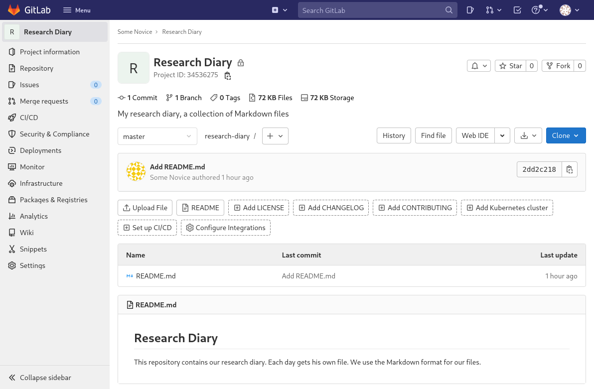

:::::::::::::::::::::::::::::::::::::: questions

- How can I use GitLab to manage my project’s files?

::::::::::::::::::::::::::::::::::::::::::::::::

::::::::::::::::::::::::::::::::::::: objectives

- Create a project.
- Change name, description, visibility, and avatar of a project.
- Push a local Git repository to a newly created project.
- Delete a project.

::::::::::::::::::::::::::::::::::::::::::::::::

## Creating a Project

After knowing how to find groups and projects. We want to go from passively
browsing GitLab to actively using it. We are going to create a project and
connect a local Git repository to it.

To create a project, click on the button with the “+” symbol in the top menu bar
and select “New project/repository”.

Multiple options are presented for how to create the new project. In this lesson
we will only look at, and use, the first option: “Create blank project”. So
click on that.

This leads to the following page:

{alt="Create blank project
dialog with text input fields labeled “Project name”, “Project URL”, “Project
slug”, “Project description (optional)”, “Project deployment target (optional)”,
a radio button element labeled “Visibility Level” with options “Private” and
“Public”, and two checkboxes labeled “Initialize repository with a README” and
“Enable Static Application Security Testing (SAST)”."}

The “Project name” field is for just that, the project name. Its value has no
other purpose and can be changed at anytime without indirect consequences (the
direct consequence being, that its name will be different). We will call it
“Research Diary”.

As we fill in the project name, a project slug gets suggested in the respective
field. The project slug is the last part of the project’s, and the associated
Git repository’s, URL or web address.

If the user belongs to at least one group, the URL’s middle part can be chosen
in the drop-down field labeled “Project URL”, which defaults to the current
user’s username. This is the location for a user’s project (and groups). Other
options in the drop-down list are the groups in which the current user may
create projects.

::: callout

### Project URL and Project Slug

The two fields under labels “Project URL” and “Project slug” are the only fields
in this dialog for which changing the value later might cause problems. Since
they determine the URL under which the project’s pages and the project’s Git
repository can be found, changing them later might brake links and bookmarks as
well as connections from Git repositories on other systems, for example on
contributors’ machines.

:::

The project description appears in many lists and on some pages under the
project’s name. We add a concise description: “My research diary, a collection
of Markdown files”

::: callout

### Markdown

Markdown is a markup language, like HTML on which the World Wide Web is based,
whose markup directives, indicating for example that something is a headline or
a list item, are such that they serve their purpose even in the plain text form.

There exist many variants (or flavors) of Markdown and GitLab has [its
own](https://docs.gitlab.com/ee/user/markdown.html). Other than for rendering
Markdown files in repositories on its web interface, GitLab allows for Markdown
input in many of its interface’s text fields, such as issue descriptions or
comments.

This will be pointed out as we get to use these fields during the lesson.

:::

We ignore the field labeled “Project deployment target (optional)”.

The choice of radio button under label “Visibility Level” determines the
project’s visibility. As mentioned in the previous episode “Finding Projects and
Groups”, the visibility “Internal” is disabled on GitLab.com, so only
“Private”, the default, and “Public” are available. We choose “Private”.

If, as per default, the checkbox “Initialize repository with a README” is
checked, the project’s repository will be initialized with a commit that adds a
file called `README.md`. Otherwise, a the project will start with an empty
repository. We will be adding such a file later ourselves, so we uncheck the
box.

::: callout

### README

A project’s README file usually contains basic information about the project:
what it contains, how it can be used (for example build or installed, if it is
a software project), how to contribute, how to get help, and licensing
information.

It is common to write README files in Markdown format, indicated by the
filename suffix `.md`.

Platforms like GitLab show the contents of project’s README file on its
homepage; if it is in Markdown format, in its rendered form.

:::

We will ignore any other fields that may be visible depending on the GitLab
instances configuration.

After clicking the “Create project” button, GitLab creates the project and
redirects us to the project’s homepage, which looks similar to this:

{alt="Project homepage for a new
project. On the left, a menu leading to other project pages: Project
Information, Issues, Merge requests, CI/CD, Security & Compliance, Deployments,
Monitor, Infrastructure, Packages & Registries, Analytics, Wiki, Snippets, and
Settings. On the right, taking the major port of the width, the project page:
Starting at the top, the project’s name “Research Diary“, followed by its
descriptions “My research diary, a collection of Markdown files”, an
encouragement to “Invite your team” with a button “Invite members”, the
statement that “The repository for this project is empty” with various buttons
for getting initial content into the repository. At the bottom, the beginning of
instructions on how to push an existing repository are visible, but cut off."}

The page is split into the menu on the left and the project overview on the
right.

The menu leads to pages related to various properties, processes, and content of
the project. It is visible on each of these pages. The number of menu entries
may seem overwhelming, in particular when one notices that the entries have
subentries. However, it is not necessary to know what hides behind all these
entries to use GitLab. Following this lesson, we will get to know parts of what
lies behind the entries “Project Information”, “Issues”, “Merge requests”,
“CI/CD”, “Wiki”, and “Settings”.

The project overview shows (from the top): The project’s avatar (or icon), name
and description; a prompt to invite team members (we will cover members later
on); a statement that our repository is currently empty with buttons for
several options to add content to it; and finally the beginning of the
instructions on how to push a local repository to this project’s repository to
fill it with content. We will follow them in just a bit.

The project overview page will look slightly different, once we have content in
its repository. We will have another look at the page then.

::: callout

### Change Name, Description, Visibility, or Avatar

Click on the “Settings” menu entry and change any of the project’s name,
description, visibility, and avatar. Do not forget to click the “Save changes”
button once you are done.

This exercise should take about 5 minutes.

:::

The project overview page presents us with many options to add content to the
project’s repository directly in GitLab. However, we will fill the project from
a local Git repository. To do that, we need a local Git repository with some
content.

## Configuring Git

Before we initialize a local Git repository, we make sure that Git is properly
configured.

To check for our name and email address, We run

```
$ git config --global --get user.name
```
{: .language-bash}

and

```
$ git config --global --get user.email
```
{: .language-bash}

If both return sensible values, we are good to go. Otherwise we provide the
missing values, for example:

```
$ git config --global user.name "Some Novice"
$ git config --global user.email "some.novice@example.com"
```
{: .language-bash}

It is now common to name the default branch `main`, rather than `master` as is
still the default in Git. For more information see, for example, the
[announcement of GitLab to change the default
branch](https://about.gitlab.com/blog/2021/03/10/new-git-default-branch-name/)
Since the discussion on this topic has started, Git has introduced a
configuration value for the initial branch created by the `git init` command. We
will use this, to make sure that all future repositories created locally start
with a branch called `main`:

```
$ git config --global init.defaultBranch main
```

## Creating a Local Repository

::: callout

### Markdown Headlines

You can mark a line in Markdown as a headline by prefixing it with between one
and six `#` characters and one space character. The number of `#` characters
indicates the heading’s level, with 1 being the most significant.

:::

::: challenge

### Research Diary’s Initial Content (Required)

Create a Git repository anywhere on your computer. Add a README file in
markdown format that describes the repository’s future contents.

Remember to use a [good commit message][CommitMessages] for your commit.

This exercise should take about 10 minutes.

::: solution

The following sequence of commands create and navigate to new directory,
initialize a repository, create a README file, and add it as part of a
commit to the repository.

```
$ mkdir research-diary
$ cd research-diary
$ git init
$ echo "# Research Diary" > README.md
$ echo "" >> README.md
$ echo "This repository contains our research diary." >> README.md
$ echo "Each day gets his own file." >> README.md
$ echo "We use the Markdown format for our files." >> README.md
$ git add README.md
$ git commit -m "Add README.md"
```
{: .language-bash}

More commonly, the file `README.md` would be created in text editor, but
that is difficult to concisely represent here.

:::

:::

[CommitMessages]: https://cbea.ms/git-commit/

Checking the status of the git repository, we should see that it exists and that
there are no changes in the working directory or in the stating area:

```
$ git status
```
{: .language-bash}
```
On branch main
nothing to commit, working tree clean
```
{: .output}

There is one file, `README.md`:

```
$ ls
```
{: .language-bash}
```
README.md
```
{: .output}

## Connecting Local and Remote Repository

Having thus created our local repository, we want to save it to our repository
in GitLab. To that end, we have a look at the project overview page again; this
time at the instructions toward the bottom of the page. They read:

> **Git global setup**
>
> ```
> git config --global user.name "Some Novice"
> git config --global user.email "some.novice@example.com"
> ```
>
> **Create a new repository**
>
> ```
> git clone https://gitlab.com/somenovice/research-diary.git
> cd test
> git switch -c main
> touch README.md
> git add README.md
> git commit -m "add README"
> git push -u origin main
> ```
>
> **Push an existing folder**
>
> ```
> cd existing_folder
> git init --initial-branch=main
> git remote add origin https://gitlab.com/somenovice/research-diary.git
> git add .
> git commit -m "Initial commit"
> git push -u origin main
> ```
>
> **Push an existing Git repository**
>
> ```
> cd existing_repo
> git remote rename origin old-origin
> git remote add origin https://gitlab.com/somenovice/research-diary.git
> git push -u origin --all
> git push -u origin --tags
> ```

We already covered the global setup.

The next three sets of instructions are mutually exclusive. The first is not for
us, because we already created a repository. Neither is the second, because
although we have a directory with contents, its already a Git repository. That
leaves us with the third option, which is the one applicable to our situation:
“Push an existing Git repository.”

Transferring our changes to a remote repository is called **push**ing, because
we are sending the changes from us, the local repository, to somewhere else, a
remote repository. Later on we will “**pull**” changes from a remote repository,
completing the analogy.

Going back to the shell, we configure our project’s repository as a remote in
our local repository:

```
$ git remote add origin https://gitlab.com/somenovice/research-diary.git
```
{: .language-bash}

::: callout

### https:// vs git@

TODO

:::

We instruct Git to add a remote called `origin` with the last part as the
address. Make sure to copy that last part from the project overview page,
because it represents the Git address of your project’s repository on GitLab. It
will be different for everyone.

Note also, that we skipped the second line of the instructions. It renames an
existing remote `origin` to `old-origin`, but we have no existing remote.

::: callout

### Names for remotes

Apart from following restrictions that Git puts on remote names, which can be
avoided without much thought by using only letters, numbers, underscores, and
hyphens, we should choose meaningful names for remotes, in particular, when we
add multiple remotes to a local repository.

In most examples, `origin` is used as the name for a remote, because it is the
name of the remote created when cloning a repository. It is a meaningful name
for the main remote repository, if there is one. This together with its
ubiquitous use make it a very good name.

In other cases, we might call a remote to a private copy of the main repository
after our username or server it is located on, for example `uni` for a
university GitLab instance.

:::

Finally, we push our changes to the remote repository. The command will prompt
for our user name and password:

```
$ git push -u origin --all
```
{: .language-bash}
```
Enumerating objects: 3, done.
Counting objects: 100% (3/3), done.
Writing objects: 100% (3/3), 250 bytes | 250.00 KiB/s, done.
Total 3 (delta 0), reused 0 (delta 0), pack-reused 0
To https://gitlab.com/somenovice/research-diary.git
 * [new branch]      main -> main
branch 'main' set up to track 'origin/main'.
```
{: .output}

Having successfully pushed our commit to the GitLab repository, we change to our
browser and navigate to the project (or reload it, if we still have it open).
We will be greeted by the project homepage, similar to the following
screenshot:

{alt="Project homepage
of a project. On the left, a menu leading to other project pages. On the right,
taking up most of the width, the project homepage. Starting from the top, we
first have the project title, Research Diary, followed by a line of statistical
values (1 Commit, 1 Branch, 0 Tags, 72KB files, 72 KB Storage). Under these we
see the description: “My research diary, a collection of Markdown files”. In
the next line we see a drop-down field for branches showing “main”, the project
slug¸“test”, a drop-down button labeled “+”, and buttons labeled “History”,
“Find file”, “Web IDE”, a download symbol, and ”Clone”. This is followed by a
box giving information on the last commit of the current branch: the commit
message “Add README.md”, the authors name and how far in the past the commit was
authored, as well as prefix of the commit’s hash with a copy-to-clipboard
button. This is followed by some buttons that allow to add or upload new files
or setup some of GitLab features for the project. Next is a list of files, in
this case only `README.md`, with information when it was last updated and
through which commit. Finally, we see a rendering of `README.md`."}

Let us look at what has changed compared to its initial state. The interface
elements encouraging us to add members to the project are gone. Of course, we
can still navigate to the project’s Members later on, if we need to. We also,
correctly, no longer get told that the repository is empty and the instructions
on how to push content to the repository have vanished.

Instead, we see some statistics below the project’s title: 1 Commit, 1 Branch, 0
Tags, 72 KB Files, 72 KB Storage. They double as buttons other project pages.

Below the description is a new button bar, followed by a box presenting
information on last commit of the currently select branch.

The buttons below, that we saw earlier, allow us to add specific files or
navigate to the configuration of certain GitLab features. Note that one button
changed from reading “Add README” to just “README”, since we added `README.md`.
The button is now a link to the latest version of that file in the current
branch.

Then we see a list of files. So far, there is only `README.md`. The list also
tells us through which commit it was last changed and when that commit was
created.

Finally, we see the markdown file `README.md` rendered. Because having a
README-file in the root directory of a repository is a widespread convention,
GitLab (and other platforms like it) usually render it on a project’s homepage.

## Deleting a Project

We just went through the beginning of a GitLab project’s life cycle. At its end,
if it has one, a project gets deleted. We will go through the process of
deleting a process now, without doing the step.

Using the menu on the left, we navigate to the projects settings.

At the bottom the page, we find a section named “Advanced”. We hit the “Expand”
button right next to it and scroll to the bottom of the page.

Notice that many of buttons here are not the usual blue or white, but first an
orange-brown and then red. This indicates that we should be careful about
clicking them. Things might break or, as we want to have a look at now, get
deleted.

At the bottom we find a section labeled “Delete Project”.

{alt="A box with red headline
“Delete this project”, followed by the warning “This action deletes
`somenovice/reseach-diary` and everything this project contains. **There is no going
back**”, and a red button labeled “Delete project”."}

Clicking the button will not directly delete the project, as the warning says,
but requires you to type the project location and slug,
`<username>/research-diary` in our case, into a text field and clicking another
button. **Do not do that now!**

::: keypoints

- Creating a GitLab project requires not more than a few clicks and providing a name
- Changing the name of description of a GitLab project after creation has no indirect consequences.
- You can fill a fresh GitLab project’s repository by pushing a local repository.
- You can delete a project, but the option is hidden well.

:::
