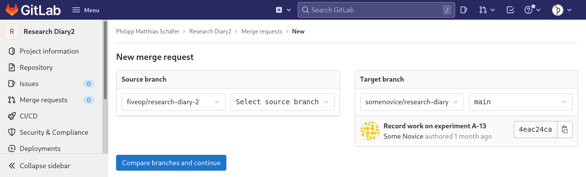

::: questions

- How can I contribute to a project on GitLab?

:::

::: objectives

- Fork a project.
- Create and edit a file on GitLab.
- Create/Accept a merge request.
- Mention an issue in GitLab markdown.

:::

In the chapter on collaboration we learned how to contribute changes to a
project that we are a member of. We also learned, in the previous chapter, that
we can contribute to other projects by filing issues to report problems or ask
questions. This episode we will learn about a way to suggest concrete changes to
a GitLab project that we do not have write access on.

The feature that allows us to do this is called Merge Request, the corresponding
feature on GitHub is called Pull Request. As a target for our merge request, we
will use our co-learners repository. We we have write access to it, but to learn
something new, we will pretend that we don’t.

We will create a merge request that adds a file listing the contributors, which
will solve the issue that we filed during the last episode.

## Create a Fork

Since we are a member of our co-learner’s project we could create a merge
request within the project. But again, to learn how to do it for project’s of
which we are not a member of, we will make ourselves some extra work.

So supposedly, we cannot make changes to our co-learner’s project. We need a
copy that we can change. Such a copy is called a fork in GitLab’s (and also
GitHub’s case). The term can be explained by looking at its use in “fork in the
road”. Once we make changes to our copy, the development history will have
split.

To create a fork, we navigate to the homepage of our co-learner’s project. In
the upper right corner is a button labeled ”Fork”. The number next to it tells
us how many forks of this repository exist on GitLab. We will now increase that
number by one by clicking on the button.

This redirects us to a form that looks like a reduced version of the “Create new
project” form. Since we do not want to make a real fork of the project, that is
project that develops in a different direction than the original, but rather
suggest a change to the original, we will leave almost everything as it is.

What we need to do is select a namespace. We will use our user namespace, so we
select ourselves in the drop-down list under ”Project URL”. We set the
visibility to private, because we will make the changes public (to those able to
see the original project) once we create the merge request. Then we click the
“Fork project” button.

::: callout

### Unique Project Name

If there already is a project with the name or the same slug, GitLab will show
you an error message which, at the time of me writing this, can be summarized to
“an error has occurred”, which is not very helpful. In that case, reload the
page, select a different name and/or slug and try again.

:::

We are redirected to the fork’s project home page. The fork is full featured
project just like the original, however, only the Git repository is copied. So,
for example, there are no issues in it, even though the original had at least one.

## Create and Edit a File on GitLab

Our goal is to create a file listing contributors to the project. We will do
this within GitLab using its file creation and editing features.

To do that, we click on the button labeled “Web IDE” in the line just below the
project’s description. This redirects us to a page with a file browser in a
column on the, with most of the screen taken up by a box informing us how to use
the Web IDE: “Select a file from the left sidebar to begin editing. Afterwards,
you’ll be able to commit your changes.”

We do not want to edit an existing file, but want to create a new one. To do
that we click on the button above the list of files on the left that is marked
with an icon representing a sheet of paper with a +-sign on top of it.

A pop-up dialog prompts us for a name, which we will provide: “CONTRIBUTORS.md”
followed by clicking the button labeled “Create file”.

::: callout

### All caps filenames

In software projects it is customary to name certain files with information
about a project in all caps. One example we already encountered is the README
file. Others are the file containing the license (`LICENSE`), a file about how
to contribute (`CONTRIBUTING`), or how to install the software (`INSTALL`).

Sometimes a file extension indicating the format is appended, usually in
lower-case letters.

:::

We see the result of our action in two ways: A file named “CONTRIBUTORS.md”
appeared in the list of files on the left and a tab labeled “CONTRIBUTORS.md”
showing an text editor appeared in the space to the right of the list of files.

We will now add something similar the following lines in the editor:

```markdown
The following persons have contributed to my research diary:

- Conner Learner
```

Then we click the button labeled “Create a commit”. The view to the left of the
list of files gets split into to columns. On the left side we see the old
version of the file (it did not exist, so nothing is shown) and on the right
side we see the new version with additions marked in green. If we had removed
anything from the old version those lines would have been marked red on the left
side.

Since everything looks as expected—one new file with called “CONTRIBUTORS.md”
with the lines we just typed in—we change the commit message to

```
Add CONTRIBUTORS.md
```

 We keep “Create a new branch” with the pre-generated name selected. For our
purposes we could also leave the checkbox “Start a new merge request” selected,
but we want to go through the merge request creation process separately to get
familiar with it, in case we want to create one from changes we pushed from a
local repository.

We do create a new branch and do not commit the changes to the branch called
“main”, because it is a good habit. We might want to create multiple independent
merge requests for one project, which cannot be done from a single branch. And
then there is the option to create merge requests within a project, those cannot
come from the branch they are supposed to be merged to, so we need another
branch anyway.

Finally, we click the button labeled “Commit”.

## Create a Merge Request

Having created the commit, we navigate back to the project home page by clicking on
the project’s name in the upper left corner.

We notice that the file that we created is not present in the list of files.
This is because GitLab shows the default branch, in our case the branch called
“main”, by default. When we click the drop-down field below the description and
the sentence starting with “Forked from…”, we get shown a list of all branches,
which should be two: “main” and the one generated for our change, something
along the lines of “…-patch-12345”. We select the new branch and now the file
“CONTRIBUTORS.md” shows up in the list of files.

To create a merge request, we click on the menu item labeled “Merge requests” in
the menu on the left and on the following page on the button labeled “New merge
request”.

This gets us to the following dialog:

{alt="New merge request page. On
the left, a menu leading to other project pages. ON the right, taking up the
major part of the width, the new merge request page: Below the page title, there
are two UI elements side-by-side. The one on the left, titled ”Source branch”,
has two drop-down fields, one to select the project, the other to select the
branch. The former reads “fiveop/research-diary-2”, the latter “Select source
branch”. The one on the right, titled “Target branch”, has the same two
drop-down fields. In this case the former reads “somenovice/research-diary” and
the latter ”main”. Belowthe two drop-down fields there is a box with information
about the last commit on the “main” branch: message, author, relative author
date and short identifier."}

On the left side, we select the branch generated for our change. Once done, a
box with details of the last commit on that branch appears below the drop-down
fields on the left.

We click the button labeled “Compare branches and continue”. On the following
page, we can see that a merge request has it’s own title and description. They
are prefilled with the newest commit message of the source branch. To connect
this merge request with the issue we filed, we write

```
Resolves #1
```

in the merge request description. Everything else, we leave with its default
value or in its default state, including the two checkboxes.

::: callout

### Closing Issues Automatically

Whenever a merge request is merged to the default branch of a project and its
description or the description of a commit it contains the phrase `<keyword>
#<number>` for one of the [keywords mentioned in GitLab’s
documentation](https://docs.gitlab.com/ee/user/project/issues/managing_issues.html#default-closing-pattern),
then the issue with number `<number>` is closed automatically.

This can save a few clicks and ensures that closing the issue will not be
forgotten.

:::

The first, labeled ”Delete source branch when merge request is accepted”, is
selected and thus let’s GitLab clean up after us; we no longer need the branch
once it has been merged.

The second, labeled “Squash commits when merge request is accepted”, is not
selected. If it were, GitLab would merge all commits of the merge request, that
is all commits on the source branch since it was branched off the target branch,
into one commit before merging. In our case, there is only one commit, so it
would serve no purpose.

We click the button labeled “Create merge request”. This leads us to the page
for the created merge request. It looks similar to the page for an issue. The
main difference are the tabs, their headers being located just below the title:
“Overview” (the one that is shown initially), “Commits”, and “Changes”.

Clicking on the tab header labeled “Commits”, we see a list of all the commits
of this merge request, which in our case is the commit we created.

Clicking on the tab header labeled “Changes”, we see a so called diff for each
of the changed files. In our case a file was added, so all the lines in the file
are new, indicated by the plus sign at the beginning of each line.

Back on the “Overview” tab, below the description there is a technical
description of the merge request, starting with “Request to merge…”, followed by
a button to “Approve“ the merge request. By default this is optional, a project
can be configured to require approval by a certain group of members for a merge
request to be possible. Then there is a grayed-out button labeled “Merge”,
followed by text that we need to ask someone with write access to click it. We
will do exactly that in a moment. Note also, that the box around it mentions
that the merge request mentions the issue. This can be easily overlooked, if the
mention happens in a commit message of the merge request.

Finally at the bottom, we see that a merge request can be commented on, just
like an issue. But for merge request there is more. Navigating to the “Changes”
tab and hovering the mouse over a line number, we see a speech bubble button
appear at the start of the line. When we press it, a text field for a comment
appears. We can use that to comment on individual lines. This feature allows to
separate discussions of different changes of a merge request.

::: callout

### Code Review

Being able to comment on individual lines is a useful feature for a practice
called code review. Code review entails that a peer of the author of some
changes reviews those, before they are merged. This practice is the origin of
the merge request feature, but it lends itself well to reviewing text based
changes other than to code.

:::

## Accept a Merge Request

While we were creating the merge request for our co-learner’s repository, they
did the same for ours. Now it is time to review and accept the change.

Navigate to the issue your co-learner created in your repository. At the very
bottom of the issue’s history you will see en entry of the form “Co-learner
@colearner mentioned in merge request !1 2 minutes ago”. The merge request
reference, ”!1”, is a link. We follow the link by clicking on it.

This leads us to the merge request page, very similar to the page of our own
merge request. The difference, that we are interested in, is the state of the
button labeled “Merge”. The button is no longer disabled. Under the button is a
bar that informs us that one commit and one merge commit will be added.

The merge commit serves as a common descendant of the heads of your main branch
and the branch on which your co-learner based their merge request. We can change
the commit message of the merge commit, by clicking on the bar informing us
about the number of added commits, but we are happy with its contents.

We click on the button labeled “Merge”. After a few seconds the box that allowed
us to merge is replaced by a box that informs us about the successful merge.

In particular, there still is a sentence informing us that the merge request
mentions an issue. Our intention was for that issue to be closed, so we click on
the issue reference, for example “#1”, to check.

On the issue page, we can see that indeed the issue was closed. The last entry
in the issue’s history reads similar to “Co-learner closed via commit abcdef12
just now”, informing us why the issue was closed.

::: keypoints

- You can create a project with a copy of another project’s repository by
  forking it.
- You can suggest changes to a project that you have no write access to through
  a merge request.
- You can close issues by use of certain keywords in merge request descriptions
  or commit messages.

:::
